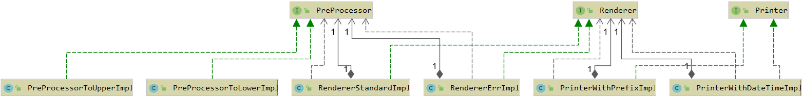

# Spring
Создание программ для изучения работы Spring Framework с использованием JdbcTemplate, 
xml-файла и конфигурации Java.

## Introduction
- Для написания программ использовалась версия Java 8.
- Отладка кода воспроизводилась на Intellij IDEA CE.
- Правила форматирования кода соответствуют общепринятым стандартам [Oracle](https://www.oracle.com/java/technologies/javase/codeconventions-namingconventions.html).

### Exercise 00

- Программа расположена в директории: ex00;
- Корневая папка проекта: Spring.

Реализована слабосвязанная система, состоящая из набора компонентов и соответствующая принципам IoC/DI.

Написан интерфейс Printer, предназначенный для отображения определенного сообщения и имеющий две реализации PrinterWithDateTimeImpl и PrinterWithPrefixImpl.

PrinterWithDateTimeImpl выводит сообщения, указывая дату/время вывода с помощью LocalDateTime, а PrinterWithPrefixImpl можно использовать для установки текстового префикса для сообщения.

В свою очередь, обе реализации принтера зависят от интерфейса Renderer, который отправляет сообщения на консоль. Renderer также имеет две реализации: RendererStandardImpl (выводит сообщение через стандартный System.out) и RendererErrImpl (выводит сообщения через System.err).

Реализации Renderer также зависит от интерфейса PreProcessor, который предварительно обрабатывает сообщения. Реализация PreProcessorToUpperImpl переводит все буквы в верхний регистр, а реализация PreProcessorToLower переводит все буквы в нижний регистр.

Описан файл context.xml для Spring, где указаны все настройки для каждого компонента и связи между ними.

UML-диаграмма классов показана ниже:



Ниже представлен код, использующий эти классы стандартным образом и Spring с помощью context.xml:

```java
public class Program {
    public static void main(String[] args) {
        System.out.println("-------------Standard way------------");
        PreProcessor preProcessor = new PreProcessorToUpperImpl();
        Renderer renderer = new RendererStandardImpl(preProcessor);
        PrinterWithDateTimeImpl printer = new PrinterWithDateTimeImpl(renderer);
        printer.print("Hello!");

        System.out.println("-------------Spring looks------------");
        ApplicationContext context = new ClassPathXmlApplicationContext("context.xml");
        Printer printerSpring = context.getBean("printPrefixErrLow", Printer.class);
        printerSpring.print("Hello");
    }
}
```
Запуск этого кода даст следующий результат:

```
-------------Standard way------------
(Current time) HELLO!
-------------Spring looks------------
prefix hello
```


### Exercise 01

- Программа расположена в директории: ex01;
- Корневая папка проекта: Service-folder.

В данном проекте реализована модель User со следующими полями:
- Identifier
- Email

Реализован интерфейс CrudRepository<T> со следующими методами:
- `Optional<T>` findById(Long id)
- `List<T>` findAll()
- void save(T entity)
- void update(T entity)
- void delete(Long id)

Интерфейс UsersRepository, объявленный как UsersRepository, расширяет CrudRepository<User>, содержит следующий метод:
- `Optional<T>` findByEmail(String email)

Кроме того, созданы две реализации UsersRepository:<br> UsersRepositoryJdbcImpl (использует стандартные механизмы Statements) и UsersRepositoryJdbcTemplateImpl (основан на NamedParameterJdbcTemaple). Оба класса принимают объект DataSource в качестве аргумента конструктора.

В файле context.xml объявлены bean-компоненты для обоих типов репозитория с разными идентификаторами, а также два bean-компонента типа DataSource: DriverManagerDataSource и HikariDataSource.

Данные для подключения к БД указаны в файле db.properties и включены в context.xml с помощью заполнителей `${db.url}`.

В классе Main работа методов продемонстрирована с использованием обоих репозиториев.

**Структура проекта**:
- Service
    - src
        - main
            - java
                - school21.spring.service
                    - models
                        - User
                    - repositories
                        - CrudRepository
                        - UsersRepository
                        - UsersRepositoryJdbcImpl
                        - UsersRepositoryJdbcTemplateImpl
                    - application
                        - Main
            - resources
                -	db.properties
                -	context.xml
                -   schema.sql
    -	pom.xml


### Exercise 02

- Программа расположена в директории: ex02;
- Корневая папка проекта: Service.

Проект основан на настройке Spring-приложения с помощью аннотаций. Для этого был реализован класс ApplicationConfig, отмеченный как @Configuration. Внутри этого класса описаны bean-компоненты для подключения к базе данных DataSource с помощью аннотации @Bean. Как и в предыдущей задаче, данные о подключении находятся внутри файла db.properties.

Реализованы интерфейс/класс UsersService/UsersServiceImpl с зависимостью от объявленного в ней UsersRepository. Вставка правильного компонента репозитория реализована с использованием аннотации @Autowired. Коллизии при автоматической привязке разрешаются с помощью аннотации @Qualifier.

Компоненты для UsersService и UsersRepository определяются с использованием аннотации @Component.

В UsersServiceImpl реализован метод String signUp(String email), который регистрирует нового пользователя и сохраняет его данные в БД. Этот метод возвращает временный пароль, назначенный пользователю системой.

**Структура проекта**:
- Service
    - src
        - main
            - java
                - school21.spring.service
                    - config
                        - ApplicationConfig
                    - models
                        - User
                    - repositories
                        - CrudRepository
                        - UsersRepository
                        - UsersRepositoryJdbcImpl
                        - UsersRepositoryJdbcTemplateImpl
                    - services
                        - UsersService
                        - UsersServiceImpl
                    - application
                        - Main
            - resources
                -	db.properties
    -	pom.xml


